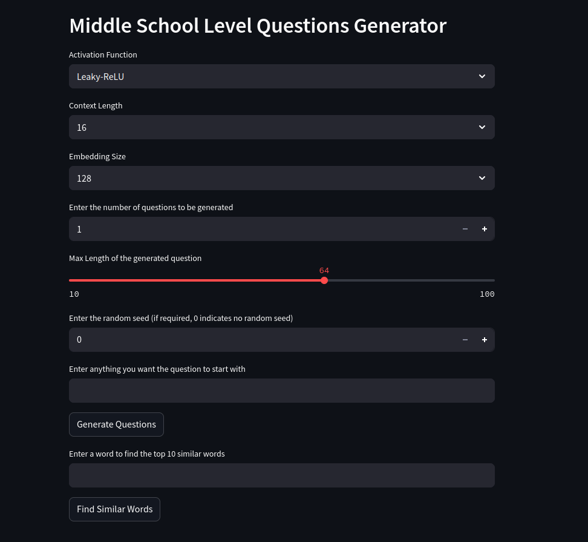
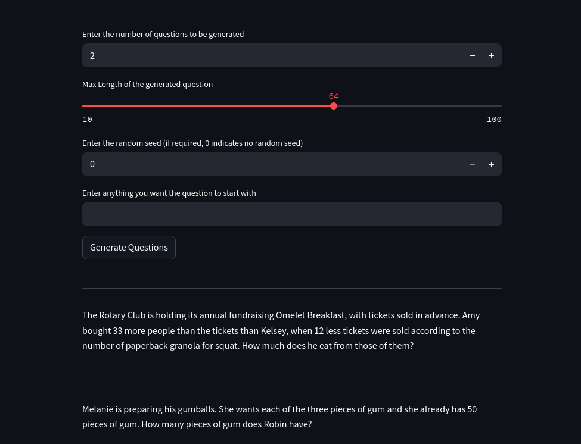
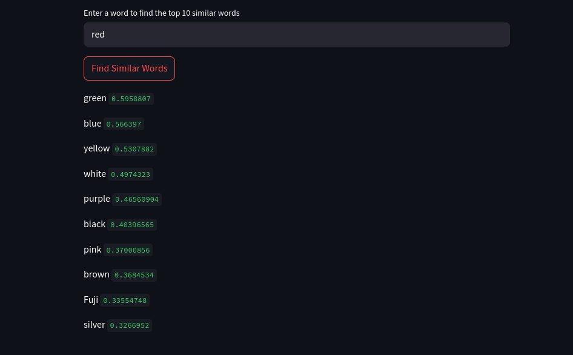

## Middle school questions generator using next word prediciton

This project was done as part of the ES335 : Machine Learning course at IIT Gandhinagar.
The requirements can be found in `requirements.txt`

The link to the streamlit interface is :
https://mlassignment3-error404.streamlit.app/

The main data preprocessing and model training file is `main_train_models.ipynb`.

 We utilise the orca dataset provided by miscrosoft which contains a large number of middle school word problems. We generate tokens based on the words present in this dataset and the corresponding integer to token mapping and token to integer mapping can be found in the `itos.pkl` and `stoi.pkl` files.

 The model consists of an embedding layer which is trainable and various models are trained with different embedding dimensions, activation function and context window size. We have provided a streamlit app where these parameters can be varied and questions be generated.

 All trained models are saved in the `models` directory. We have further generated tsne visualisations for all models from the learnt embedding layer and these can be found in the `tsne_images` and `big_tsne_images` directory.

Since the visualisations are very large in size, the streamlit app also has a feature to query the top - similar words to a given word based on cosine similarity.

Misc:

As part of the project we have also comapred the performance on MLP vs RF and Logisitic regression models on the MNIST dataset. These results can be found in `misc-MLPperf_onMNIST.ipynb`
